<p align="center">
  
</p>

<h1 align="center">CERDAS</h1>

<p align="center">
  <b>Cheating Examination Recognition &amp; Detection · YOLO-based</b><br>
  Deteksi indikasi mencontek dari arah kepala, langsung di perangkat Android.<br>
  <i>On-device exam proctoring that reads head direction with YOLO.</i>
</p>

<p align="center">
  <a href="#bahasa-indonesia">Bahasa Indonesia</a> · <a href="#english">English</a>
</p>

<table>
  <tr>
    <td align="center" width="25%">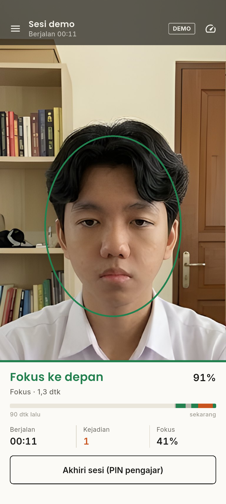<br><sub>Sesi berjalan</sub></td>
    <td align="center" width="25%">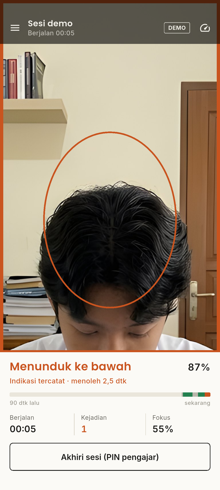<br><sub>Peringatan menoleh</sub></td>
    <td align="center" width="25%">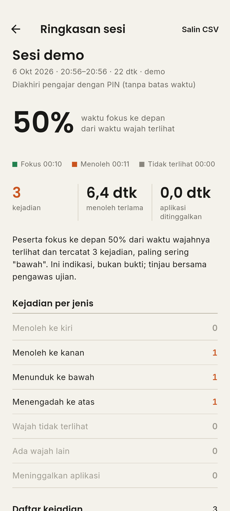<br><sub>Ringkasan sesi</sub></td>
    <td align="center" width="25%">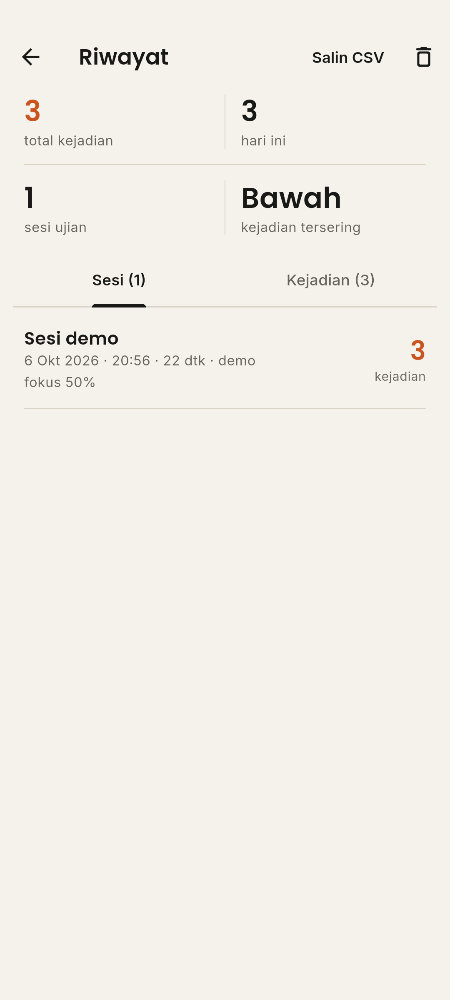<br><sub>Riwayat</sub></td>
  </tr>
</table>

---

## Bahasa Indonesia

### Daftar isi

1. [Tentang](#tentang)
2. [Fitur](#fitur)
3. [Kinerja: target 30 FPS](#kinerja-target-30-fps)
4. [Cara kerja](#cara-kerja)
5. [Aturan sesi](#aturan-sesi)
6. [Alur penggunaan](#alur-penggunaan)
7. [Mode demo dan wajah dummy](#mode-demo-dan-wajah-dummy)
8. [Pengaturan](#pengaturan)
9. [Menjalankan dan build](#menjalankan-dan-build)
10. [Tangkapan layar](#tangkapan-layar)
11. [Struktur proyek](#struktur-proyek)
12. [Privasi dan etika](#privasi-dan-etika)
13. [Lisensi dan kredit](#lisensi-dan-kredit)

### Tentang

CERDAS memantau arah kepala peserta ujian lewat kamera depan. Model YOLOv12n
mengenali lima arah: **depan** (fokus) dan **atas, bawah, kiri, kanan**
(indikasi menoleh). Bila peserta menoleh lebih lama dari batas yang diatur
pengajar, aplikasi membunyikan alarm, menggetarkan perangkat, dan mencatat
kejadian. Semua inferensi berjalan di perangkat dan tanpa internet.

### Fitur

| Fitur | Keterangan |
|---|---|
| Deteksi real-time | YOLOv12n (LiteRT, GPU bila tersedia) membaca arah kepala dari kamera depan |
| Oval panduan wajah | Oval di tengah layar menunjukkan posisi wajah; warnanya hijau saat fokus, oranye saat menoleh. Wajah tidak tertutup kotak atau label |
| Sesi ujian | Dimulai pengajar dengan PIN, punya durasi, dan berakhir otomatis saat waktu habis |
| Garis waktu 90 detik | Pita warna di panel bawah: hijau fokus, oranye menoleh, abu-abu wajah hilang |
| Aturan lama menoleh | Menoleh sekilas tidak dihitung; batasnya diatur di Pengaturan (bawaan 0,8 dtk) |
| Kejadian lain | Wajah tidak terlihat, ada wajah lain di kamera, dan aplikasi ditinggalkan ikut dicatat |
| Peringatan | Tepi layar oranye, alarm suara, getar; jeda antar alarm bisa diatur |
| Ringkasan sesi | Persentase fokus, menoleh terlama, lama aplikasi ditinggalkan, tabel kejadian, salin CSV |
| Riwayat | Daftar sesi dan kejadian per tanggal, ekspor CSV |
| Akses pengajar (PIN) | Mulai/akhiri sesi, Riwayat, Pengaturan, dan ganti kamera saat sesi butuh PIN |
| Mode siaga | Di luar sesi: deteksi tampil untuk mengatur posisi HP, tanpa alarm dan tanpa catatan |
| Mode demo | Memutar foto wajah dummy, model dijalankan sungguhan, tanpa kamera |
| Info teknis | FPS, waktu pra-proses, inferensi, pasca-proses, jumlah frame |
| Luring | Tidak ada server; gambar kamera tidak disimpan dan tidak dikirim |

### Kinerja: target 30 FPS

Model yang dipakai sudah ringan: masukan 320×320 dan sekitar **9 ms per frame**
di CPU desktop. Versi lama lambat karena alur aplikasinya, bukan modelnya:

| Penyebab di versi lama | Perbaikan |
|---|---|
| Plugin `ultralytics_yolo` 0.1.39 mengubah tiap frame YUV → JPEG (kualitas 100) → decode lagi | Naik ke 0.6.15: frame RGBA langsung, LiteRT 2.x dengan GPU |
| Seluruh layar di-`setState` setiap frame dan setiap metrik FPS | Hasil masuk ke `ProctorEngine`; UI memakai `ValueNotifier` dan hanya diperbarui saat status berubah (maks. ±10×/dtk) |
| Kamera depan dipasang dengan `switchCamera` + `switchModel` (memuat ulang model) | Kamera depan dipilih sejak awal (`lensFacing`) |
| Kamera tetap berjalan saat layar lain dibuka | Kamera dijeda saat pengajar membuka Riwayat atau Pengaturan, dan saat aplikasi di latar belakang |

FPS sebenarnya tergantung perangkat dan dibatasi kecepatan kamera (umumnya
30 fps). Lihat angka FPS di pojok kanan atas atau buka **Info teknis**.

### Cara kerja

<p align="center"></p>

Logika keputusan ada di [`lib/logic/proctor_engine.dart`](lib/logic/proctor_engine.dart),
ditulis tanpa ketergantungan pada plugin sehingga bisa diuji
([`test/proctor_engine_test.dart`](test/proctor_engine_test.dart)):

- **Stabilisasi**: status baru berganti setelah N frame berturut-turut sepakat (bawaan 2).
  Wajah yang hilang satu-dua frame tidak langsung dianggap hilang (jeda 0,3 dtk).
- **Lama menoleh**: kejadian dicatat bila menoleh berlangsung minimal 0,8 dtk.
  Satu rentang menoleh dicatat sekali; alarm diulang tiap jeda selama masih menoleh.
- **Wajah hilang**: hanya saat sesi berjalan, setelah 5 dtk (bisa dimatikan).

| Kelas model | Label | Status |
|---|---|---|
| `depan` | Fokus ke depan | Fokus |
| `atas` | Menengadah ke atas | Indikasi |
| `bawah` | Menunduk ke bawah | Indikasi |
| `kiri` | Menoleh ke kiri | Indikasi |
| `kanan` | Menoleh ke kanan | Indikasi |

### Aturan sesi

Aplikasi dipegang di meja peserta, jadi aturan dibuat supaya peserta tidak bisa
mengakali pemantauan:

| Aturan | Alasan |
|---|---|
| Memulai sesi wajib PIN pengajar, sekaligus menentukan durasi ujian | Peserta tidak bisa memulai ulang sesi untuk menghapus catatan |
| Sesi berakhir otomatis saat waktu habis; mengakhiri lebih awal wajib PIN, juga di mode demo | Peserta tidak bisa menghentikan pemantauan sendiri |
| Tombol kembali Android dikunci selama sesi | Mencegah keluar tanpa sengaja |
| Meninggalkan aplikasi dicatat sebagai kejadian beserta lamanya | Mencegah membuka browser atau chat untuk mencari jawaban |
| Dua wajah terpisah selama lebih dari 1,5 dtk dicatat sebagai "Ada wajah lain" | Indikasi ada yang membantu |
| Ganti kamera dan mode demo dikunci selama sesi | Peserta tidak bisa mengalihkan kamera |
| Akses pengajar tertutup lagi 60 dtk setelah PIN dimasukkan, dan saat sesi dimulai | Kunci tidak tertinggal terbuka |
| Di luar sesi aplikasi dalam mode siaga, tanpa alarm dan catatan | Pengajar bisa mengatur posisi HP tanpa membuat riwayat palsu |

### Alur penggunaan

**Sebelum ujian (pengajar)**
1. Letakkan HP di depan peserta. Dalam mode siaga, atur posisinya sampai wajah berada di dalam oval.
2. (Opsional) Buka menu → **Pengaturan** untuk mengatur ambang, lama menoleh, dan durasi bawaan.
3. Tekan **Mulai sesi ujian**, masukkan PIN (dibuat saat pertama kali), isi nama sesi dan durasi.

**Selama ujian (peserta)**
4. Layar menampilkan kamera, oval wajah, status, sisa waktu, dan jumlah kejadian. Peserta tidak bisa
   mengakhiri sesi, membuka Riwayat atau Pengaturan, mengganti kamera, atau keluar dengan tombol kembali.

**Setelah ujian (pengajar)**
5. Sesi berakhir otomatis saat waktu habis, atau tekan **Akhiri sesi** dan masukkan PIN.
6. Ringkasan sesi langsung tampil. Semua sesi bisa dibuka lagi di **Riwayat**, lalu disalin sebagai CSV.

### Mode demo dan wajah dummy

<p align="center"></p>

Mode demo (menu → **Mode demo**) memutar lima foto secara bergantian dan
menjalankan model yang sama dengan kamera lewat `YOLO.predict`. Tujuannya untuk
presentasi, mencoba aplikasi tanpa peserta, dan membuat tangkapan layar.

- Orang di foto **fiktif**, dibuat oleh pemilik proyek dengan Google Gemini, bukan foto orang nyata.
- Kolase asli dipotong per pose lalu diperbesar 4× dengan Real-ESRGAN agar tidak pecah di layar.
- Keyakinan model pada foto final: depan 0,91 · kiri 0,78 · kanan 0,90 · atas 0,92 · bawah 0,87
  (lihat [`assets/demo/hasil_model.json`](assets/demo/hasil_model.json)).
- Skrip lengkapnya ada di [`tools/make_demo_faces.py`](tools/make_demo_faces.py).

### Pengaturan

| Pengaturan | Bawaan | Fungsi |
|---|---|---|
| Ambang keyakinan | 70% | Deteksi di bawah angka ini diabaikan |
| Frame stabil | 2 | Frame berturut-turut sebelum status berganti |
| Lama menoleh minimum | 0,8 dtk | Menoleh lebih singkat tidak dianggap kejadian |
| Wajah tidak terlihat | 5 dtk | Selama sesi; 0 = mati |
| Durasi bawaan | 90 mnt | Diusulkan saat memulai sesi; 0 = tanpa batas |
| Suara alarm / Getar | aktif | Jenis peringatan |
| Jeda antar peringatan | 3 dtk | Agar alarm tidak berbunyi terus |
| Catat riwayat | aktif | Simpan kejadian ke Riwayat |
| Mulai dengan kamera depan | aktif | Kamera bawaan saat aplikasi dibuka |
| Layar tetap menyala | aktif | Cegah layar tidur selama pemantauan |

### Menjalankan dan build

Butuh Flutter 3.41+ (Dart 3.9+) dan perangkat Android berkamera (minSdk 24).

```bash
flutter pub get
flutter run                                   # jalankan di perangkat
flutter test                                  # 21 uji unit dan widget
flutter build apk --release --split-per-abi   # APK per arsitektur
```

Model: [`assets/models/gaze_yolo12n_320.tflite`](assets/models/)
(kelas dan ukuran masukan dibaca dari metadata model). Model lama yang tidak dipakai
disimpan di [`Training_Yolo/models/`](Training_Yolo/models/) bersama notebook pelatihan.
Saat ini hanya Android yang didukung; iOS membutuhkan model Core ML.

### Tangkapan layar

Semua tangkapan layar dibuat otomatis dari mode demo di emulator:

```bash
flutter drive --driver=test_driver/integration_test.dart \
  --target=integration_test/screenshots_test.dart
```

| | | | |
|---|---|---|---|
| 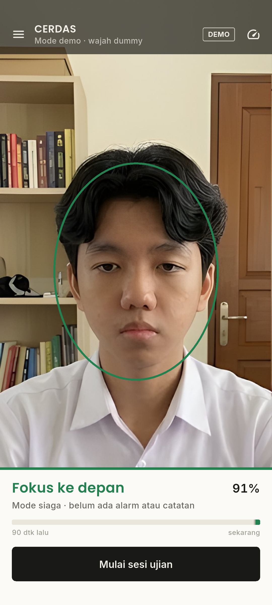 | 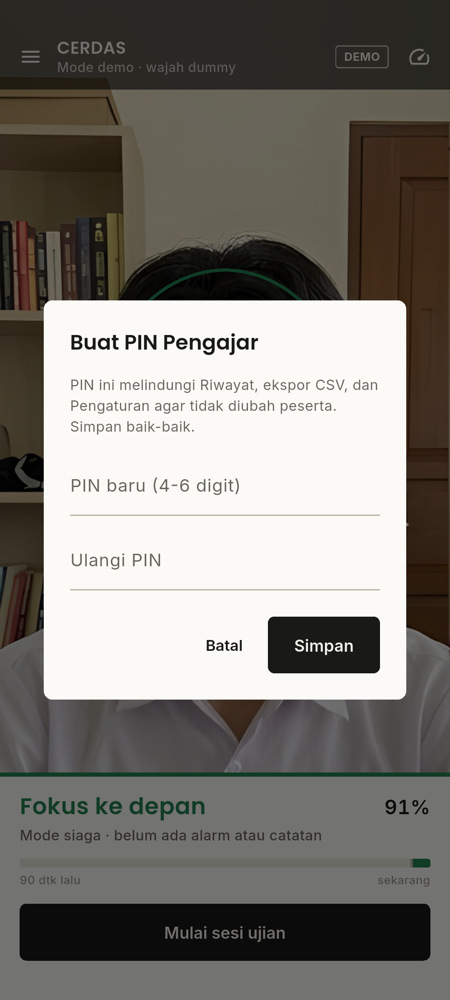 | 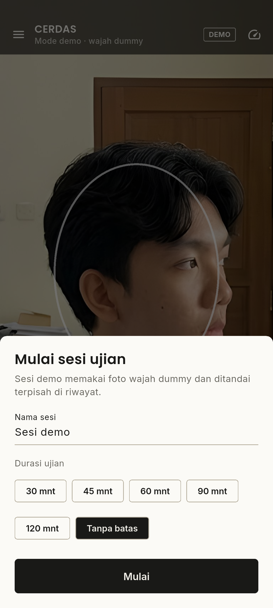 |  |
| Mode siaga | PIN pengajar | Mulai sesi | Peringatan menoleh |
|  | 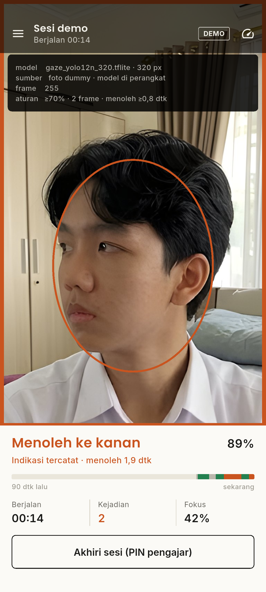 |  | 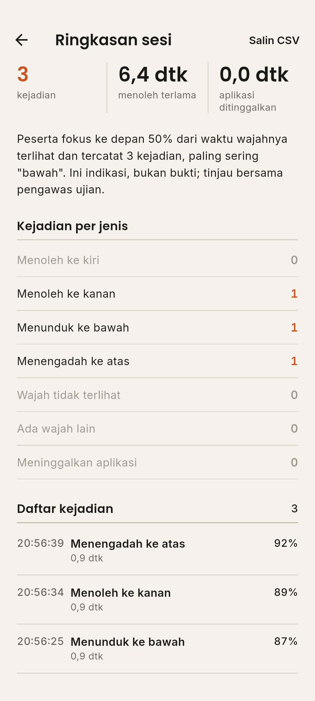 |
| Sesi berjalan | Info teknis | Ringkasan sesi | Kejadian sesi |
| 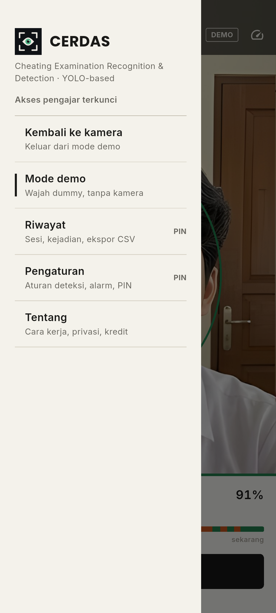 |  | 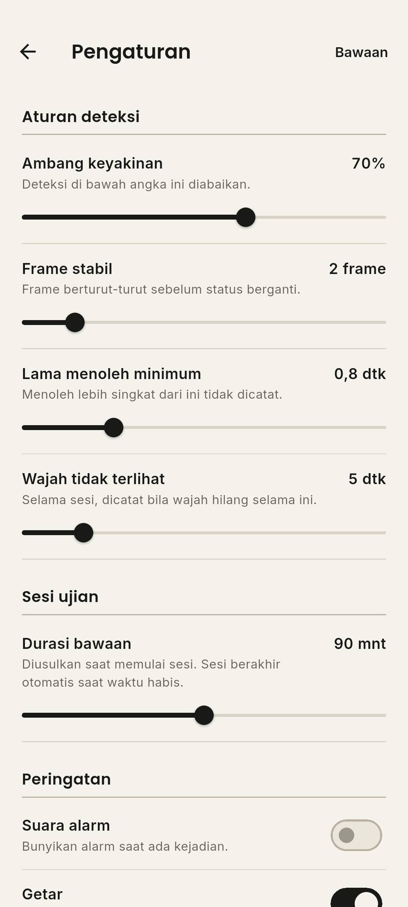 | 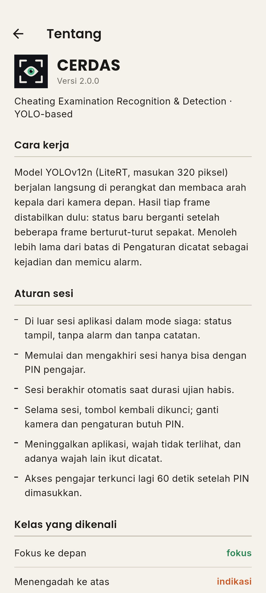 |
| Menu | Riwayat | Pengaturan | Tentang |

### Struktur proyek

```
lib/
  main.dart                     Titik masuk, tema, layanan
  logic/proctor_engine.dart     Stabilisasi, aturan menoleh, wajah hilang, durasi sesi
  models/                       Arah pandang, kejadian, sesi ujian
  services/                     Pengaturan, riwayat, sesi, alarm, mode demo, PIN pengajar
  screens/                      Kamera, ringkasan sesi, riwayat, pengaturan, tentang
  widgets/                      Oval wajah, garis waktu, panel status, tabel, menu
  theme/app_theme.dart          Gaya lembar ujian (kertas, tinta, garis), Poppins + Inter
assets/                         Model, suara alarm, foto demo, logo, font
tools/                          Pembuat alarm, ikon, dan foto demo
Training_Yolo/                  Notebook pelatihan dan model arsip
test/, integration_test/        Uji unit/widget dan tangkapan layar
```

### Privasi dan etika

- Gambar kamera tidak disimpan dan tidak dikirim. Yang disimpan hanya arah, keyakinan, waktu, dan durasi.
- Arah kepala adalah **indikasi**, bukan bukti. Tinjau hasilnya bersama pengawas ujian.
- Beri tahu peserta bahwa ujian dipantau kamera sebelum sesi dimulai.

### Lisensi dan kredit

- Kode aplikasi: **AGPL-3.0** ([LICENSE](LICENSE)). Lisensi ini dipakai karena model dilatih
  dengan Ultralytics dan aplikasi memakai plugin `ultralytics_yolo`, keduanya AGPL-3.0.
- Model YOLOv12n dilatih oleh Khairuramdhani dan Naufal Arya Pradipta.
- Foto wajah dummy: orang fiktif buatan AI (Google Gemini) oleh pemilik proyek; diperbesar dengan
  [Real-ESRGAN](https://github.com/xinntao/Real-ESRGAN) (BSD-3-Clause).
- Font Poppins dan Inter: SIL Open Font License 1.1 (lihat `assets/fonts/`).
- Logo dan ikon dibuat sendiri dengan [`tools/make_icon.py`](tools/make_icon.py).

---

## English

### About

CERDAS (Cheating Examination Recognition & Detection) watches the examinee's head
direction through the front camera. A YOLOv12n model recognises five classes:
`depan` (facing forward) and `atas`, `bawah`, `kiri`, `kanan` (looking up, down,
left, right). When a look-away lasts longer than the teacher's limit, the app
sounds an alarm, vibrates, and logs the incident. Inference runs on the device.

### Highlights

- **Real-time detection** with LiteRT on the GPU when available.
- **Exam sessions** started by the teacher with a PIN and a planned duration; they end automatically.
- **Session rules**: the back button is locked, leaving the app and a second face are logged,
  switching cameras needs the PIN, and the teacher unlock expires after 60 seconds.
- **Standby mode** outside a session: detection is shown for positioning, with no alarms or logs.
- **Face oval** guide in the centre, a 90-second timeline, and a minimum look-away rule.
- **Demo mode** that runs the real model on five dummy faces, with no camera needed.
- **History** of sessions and incidents with CSV export.

### Performance

The model itself is light: 320 px input, about 9 ms per frame on a desktop CPU.
The old app was slow because of its pipeline:
- The plugin round-tripped every frame through JPEG; it is now version 0.6.15 with RGBA frames and LiteRT 2.x.
- The whole screen rebuilt on every frame; detections now go through `ProctorEngine` and
  `ValueNotifier`s, so the UI only updates when the state changes.
- The camera is paused while other screens are open.

Actual FPS depends on the device and is capped by the camera frame rate, usually 30 fps.

### Run

```bash
flutter pub get
flutter run
flutter test
flutter build apk --release --split-per-abi
```

Android only for now (minSdk 24). Screenshots are generated with
`flutter drive --driver=test_driver/integration_test.dart --target=integration_test/screenshots_test.dart`.

### Privacy

Camera frames are never stored or uploaded; only direction, confidence, time, and
duration are kept. Head direction is a signal, not proof, so review incidents with
the exam supervisor.

### License

AGPL-3.0, because the model was trained with Ultralytics and the app uses the
`ultralytics_yolo` plugin, both AGPL-3.0. The demo faces are fictional people generated
with Google Gemini and upscaled with Real-ESRGAN (BSD-3-Clause). Poppins and Inter are under the SIL OFL 1.1.
