<p align="center">
  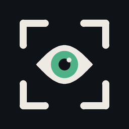
</p>

<h1 align="center">CERDAS</h1>

<p align="center">
  <b>Cheating Examination Recognition &amp; Detection · YOLO-based</b><br>
  Deteksi indikasi mencontek berdasarkan arah kepala, langsung di perangkat Android.<br>
  <i>On-device exam proctoring that reads head direction with YOLO.</i>
</p>

<p align="center">
  <a href="#bahasa-indonesia">Bahasa Indonesia</a> · <a href="#english">English</a>
</p>

<p align="center">
  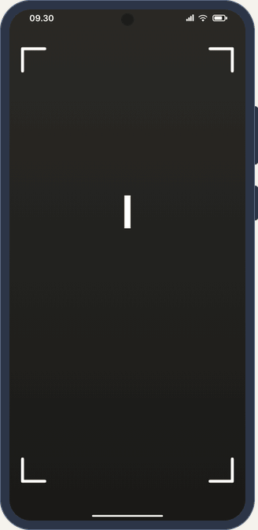
</p>

<table>
  <tr>
    <td align="center" width="25%">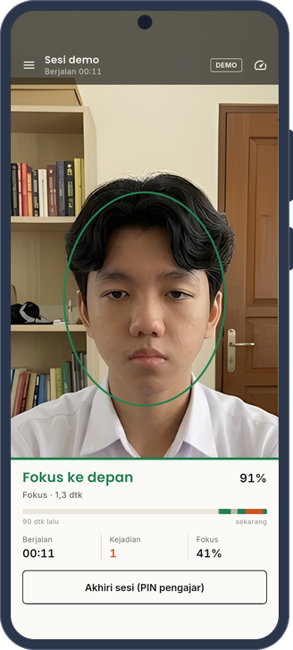<br><sub>Sesi berjalan</sub></td>
    <td align="center" width="25%">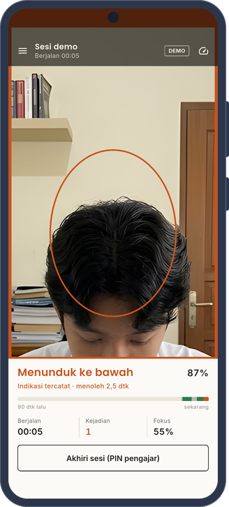<br><sub>Peringatan menoleh</sub></td>
    <td align="center" width="25%">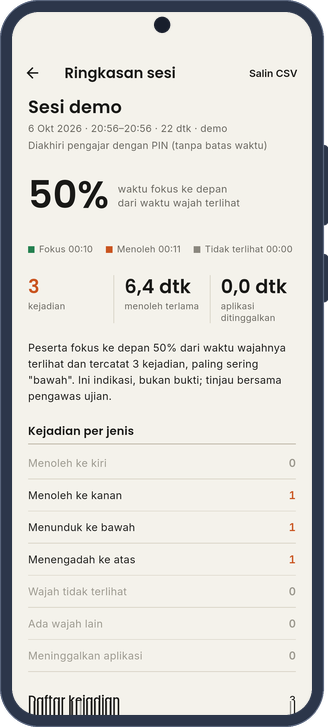<br><sub>Ringkasan sesi</sub></td>
    <td align="center" width="25%">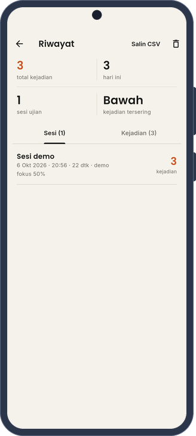<br><sub>Riwayat</sub></td>
  </tr>
</table>

---

## Bahasa Indonesia

### Daftar isi

1. [Tentang](#tentang)
2. [Fitur](#fitur)
3. [Kinerja: target 30 FPS](#kinerja-target-30-fps)
4. [Cara kerja](#cara-kerja)
5. [Aturan sesi](#aturan-sesi)
6. [Alur penggunaan](#alur-penggunaan)
7. [Mode demo dan wajah dummy](#mode-demo-dan-wajah-dummy)
8. [Pengaturan](#pengaturan)
9. [Menjalankan dan build](#menjalankan-dan-build)
10. [Tangkapan layar](#tangkapan-layar)
11. [Struktur proyek](#struktur-proyek)
12. [Privasi dan etika](#privasi-dan-etika)
13. [Lisensi dan kredit](#lisensi-dan-kredit)

### Tentang

CERDAS memantau arah kepala peserta ujian melalui kamera depan. Model YOLOv12n mengenali lima arah, yaitu **depan**
sebagai tanda fokus serta **atas, bawah, kiri,** dan **kanan** sebagai indikasi menoleh. Apabila peserta menoleh lebih
lama daripada batas yang ditetapkan pengajar, aplikasi membunyikan alarm, menggetarkan perangkat, dan mencatat
kejadian tersebut. Seluruh inferensi berjalan di perangkat tanpa memerlukan internet.

Pembukanya bertema kamera pengawas. Di layar gelap, sapaan "Halo!" diketik huruf demi huruf, lalu empat sudut bidik
bergerak dari tepi layar dan mengunci di tengah, dan garis pindai menyapu ke bawah sehingga layar berubah terang. Di
dalam bidikan, sebuah wajah sesekali menoleh: sudutnya hijau saat wajah menghadap depan dan jingga saat menoleh,
seperti yang dideteksi aplikasi. Ketuk sisi kiri atau kanan layar untuk membuat wajah itu menoleh. Sejak versi ini,
PIN pengajar terkunci sementara setelah lima kali salah, makin lama bila diulang, sehingga PIN tidak bisa ditebak satu
per satu selama ujian.

### Fitur

| Fitur | Keterangan |
|---|---|
| Deteksi real-time | YOLOv12n berjalan dengan LiteRT, memakai GPU bila tersedia, dan membaca arah kepala dari kamera depan. |
| Oval panduan wajah | Oval di tengah layar menunjukkan posisi wajah yang ideal; warnanya hijau saat peserta fokus dan oranye saat menoleh. Wajah tidak ditutupi kotak atau label. |
| Sesi ujian | Sesi dimulai oleh pengajar dengan PIN, memiliki durasi, dan berakhir otomatis ketika waktu habis. |
| Garis waktu 90 detik | Pita warna di panel bawah menunjukkan riwayat singkat: hijau untuk fokus, oranye untuk menoleh, dan abu-abu ketika wajah tidak terlihat. |
| Aturan lama menoleh | Gerakan menoleh yang singkat tidak dihitung; batasnya diatur di Pengaturan dengan nilai bawaan 0,8 detik. |
| Kejadian lain | Wajah yang tidak terlihat, wajah lain di kamera, dan aplikasi yang ditinggalkan juga dicatat. |
| Peringatan | Tepi layar berubah oranye, alarm berbunyi, dan perangkat bergetar; jeda antarperingatan dapat diatur. |
| Ringkasan sesi | Persentase fokus, durasi menoleh terlama, lama aplikasi ditinggalkan, tabel kejadian, dan salinan CSV. |
| Riwayat | Daftar sesi dan kejadian per tanggal yang dapat diekspor ke CSV. |
| Akses pengajar | Memulai dan mengakhiri sesi, membuka Riwayat dan Pengaturan, serta mengganti kamera selama sesi memerlukan PIN. |
| Mode siaga | Di luar sesi, deteksi tetap ditampilkan untuk mengatur posisi ponsel, tetapi tanpa alarm dan tanpa catatan. |
| Mode demo | Foto wajah dummy diputar bergantian dan diproses oleh model sungguhan tanpa kamera. |
| Info teknis | Menampilkan FPS, waktu pra-pemrosesan, inferensi, pasca-pemrosesan, dan jumlah frame. |
| Luring | Tidak ada server; gambar kamera tidak disimpan dan tidak dikirim ke mana pun. |

### Kinerja: target 30 FPS

Model yang dipakai sudah tergolong ringan, dengan masukan 320×320 dan waktu sekitar **9 ms per frame** di CPU
desktop. Versi lama aplikasi terasa lambat bukan karena modelnya, melainkan karena alur pemrosesan di aplikasi.
Tabel berikut merangkum penyebab tersebut beserta perbaikannya.

| Penyebab di versi lama | Perbaikan |
|---|---|
| Plugin `ultralytics_yolo` 0.1.39 mengubah setiap frame dari YUV ke JPEG berkualitas 100, lalu mendekodenya kembali. | Plugin dinaikkan ke versi 0.6.15 sehingga frame RGBA diproses langsung dengan LiteRT 2.x dan GPU. |
| Seluruh layar dibangun ulang dengan `setState` pada setiap frame dan setiap pembaruan FPS. | Hasil deteksi dialirkan ke `ProctorEngine`, sedangkan antarmuka memakai `ValueNotifier` dan hanya diperbarui ketika status berubah, paling banyak sekitar sepuluh kali per detik. |
| Kamera depan dipasang dengan `switchCamera` dan `switchModel`, sehingga model dimuat ulang. | Kamera depan dipilih sejak awal melalui `lensFacing`. |
| Kamera tetap berjalan ketika layar lain dibuka. | Kamera dijeda ketika pengajar membuka Riwayat atau Pengaturan dan ketika aplikasi berada di latar belakang. |

FPS sesungguhnya bergantung pada perangkat dan dibatasi oleh kecepatan kamera, yang umumnya 30 fps. Angka FPS dapat
dilihat di pojok kanan atas layar atau melalui menu **Info teknis**.

### Cara kerja

<p align="center">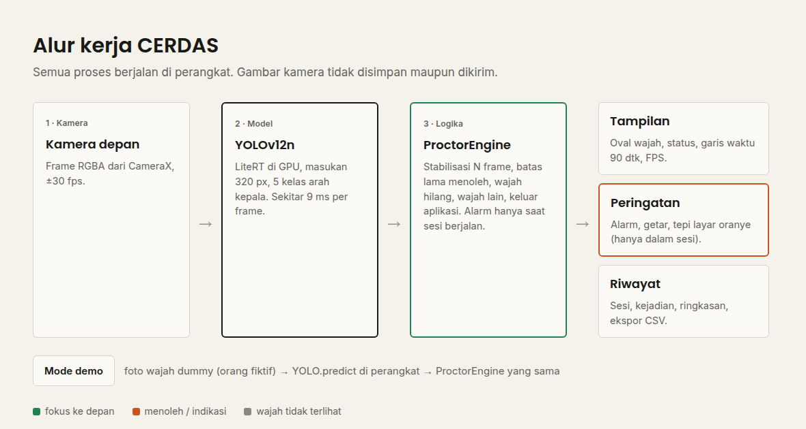</p>

Logika keputusan berada di [`lib/logic/proctor_engine.dart`](lib/logic/proctor_engine.dart) dan ditulis tanpa
ketergantungan pada plugin, sehingga dapat diuji secara terpisah di
[`test/proctor_engine_test.dart`](test/proctor_engine_test.dart). Status baru berganti setelah sejumlah frame
berturut-turut menunjukkan hasil yang sama, dengan nilai bawaan dua frame, dan wajah yang hilang selama satu atau dua
frame tidak langsung dianggap hilang karena ada jeda 0,3 detik. Sebuah kejadian menoleh dicatat apabila berlangsung
sekurang-kurangnya 0,8 detik. Satu rentang menoleh hanya dicatat satu kali, sedangkan alarm diulang sesuai jeda selama
peserta masih menoleh. Kejadian wajah tidak terlihat hanya dicatat selama sesi berjalan, setelah lima detik, dan
dapat dinonaktifkan.

| Kelas model | Label | Status |
|---|---|---|
| `depan` | Fokus ke depan | Fokus |
| `atas` | Menengadah ke atas | Indikasi |
| `bawah` | Menunduk ke bawah | Indikasi |
| `kiri` | Menoleh ke kiri | Indikasi |
| `kanan` | Menoleh ke kanan | Indikasi |

### Aturan sesi

Ponsel diletakkan di meja peserta, sehingga aturan sesi dirancang agar peserta tidak dapat mengakali pemantauan.

| Aturan | Alasan |
|---|---|
| Memulai sesi memerlukan PIN pengajar sekaligus penetapan durasi ujian. | Peserta tidak dapat memulai ulang sesi untuk menghapus catatan. |
| Sesi berakhir otomatis ketika waktu habis; mengakhiri lebih awal memerlukan PIN, termasuk dalam mode demo. | Peserta tidak dapat menghentikan pemantauan sendiri. |
| Tombol kembali Android dikunci selama sesi. | Mencegah peserta keluar dari aplikasi secara tidak sengaja. |
| Meninggalkan aplikasi dicatat sebagai kejadian beserta lamanya. | Mencegah peserta membuka peramban atau aplikasi percakapan untuk mencari jawaban. |
| Dua wajah terpisah yang terlihat lebih dari 1,5 detik dicatat sebagai "Ada wajah lain". | Menjadi indikasi adanya orang lain yang membantu. |
| Penggantian kamera dan mode demo dikunci selama sesi. | Peserta tidak dapat mengalihkan kamera. |
| Akses pengajar tertutup kembali 60 detik setelah PIN dimasukkan dan ketika sesi dimulai. | Akses pengajar tidak tertinggal dalam keadaan terbuka. |
| Di luar sesi, aplikasi berada dalam mode siaga tanpa alarm dan tanpa catatan. | Pengajar dapat mengatur posisi ponsel tanpa menghasilkan riwayat palsu. |

### Alur penggunaan

Sebelum ujian, pengajar meletakkan ponsel di depan peserta dan, dalam mode siaga, mengatur posisinya hingga wajah
peserta berada di dalam oval. Bila diperlukan, ambang keyakinan, lama menoleh, dan durasi bawaan dapat diatur melalui
menu **Pengaturan**. Pengajar kemudian menekan **Mulai sesi ujian**, memasukkan PIN yang dibuat pada penggunaan
pertama, serta mengisi nama dan durasi sesi.

Selama ujian, layar menampilkan kamera, oval wajah, status, sisa waktu, dan jumlah kejadian. Peserta tidak dapat
mengakhiri sesi, membuka Riwayat atau Pengaturan, mengganti kamera, maupun keluar melalui tombol kembali.

Sesi berakhir otomatis ketika waktu habis, atau pengajar dapat menekan **Akhiri sesi** dan memasukkan PIN. Ringkasan
sesi langsung ditampilkan, dan setiap sesi dapat dibuka kembali di **Riwayat** untuk disalin sebagai CSV.

### Mode demo dan wajah dummy

<p align="center">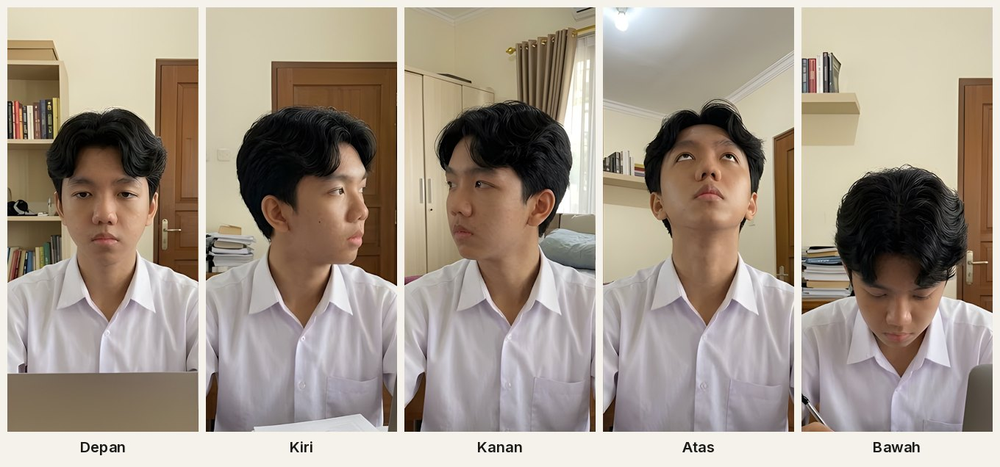</p>

Mode demo, yang dapat dibuka melalui menu **Mode demo**, memutar lima foto secara bergantian dan menjalankan model
yang sama dengan kamera melalui `YOLO.predict`. Mode ini ditujukan untuk presentasi, mencoba aplikasi tanpa peserta,
dan membuat tangkapan layar. Orang dalam foto tersebut **fiktif**; gambarnya dibuat oleh pemilik proyek dengan Google
Gemini dan bukan foto orang nyata. Kolase aslinya dipotong per pose, kemudian diperbesar empat kali dengan
Real-ESRGAN agar tetap tajam di layar. Keyakinan model pada foto akhir adalah 0,91 untuk depan, 0,78 untuk kiri, 0,90
untuk kanan, 0,92 untuk atas, dan 0,87 untuk bawah, sebagaimana tercatat di
[`assets/demo/hasil_model.json`](assets/demo/hasil_model.json). Skrip pembuatnya tersedia di
[`tools/make_demo_faces.py`](tools/make_demo_faces.py).

### Pengaturan

| Pengaturan | Bawaan | Fungsi |
|---|---|---|
| Ambang keyakinan | 70% | Deteksi dengan keyakinan di bawah nilai ini diabaikan. |
| Frame stabil | 2 | Jumlah frame berturut-turut sebelum status berganti. |
| Lama menoleh minimum | 0,8 detik | Gerakan menoleh yang lebih singkat tidak dianggap kejadian. |
| Wajah tidak terlihat | 5 detik | Berlaku selama sesi; nilai 0 menonaktifkannya. |
| Durasi bawaan | 90 menit | Diusulkan ketika sesi dimulai; nilai 0 berarti tanpa batas. |
| Suara alarm dan getar | Aktif | Jenis peringatan yang diberikan. |
| Jeda antarperingatan | 3 detik | Mencegah alarm berbunyi terus-menerus. |
| Catat riwayat | Aktif | Menyimpan kejadian ke Riwayat. |
| Mulai dengan kamera depan | Aktif | Kamera yang dipakai saat aplikasi dibuka. |
| Layar tetap menyala | Aktif | Mencegah layar mati selama pemantauan. |

### Menjalankan dan build

Aplikasi memerlukan Flutter 3.41 atau yang lebih baru (Dart 3.9 ke atas) serta perangkat Android berkamera dengan
minSdk 24.

```bash
flutter pub get
flutter run
flutter test
flutter build apk --release --split-per-abi
```

`flutter test` menjalankan 28 uji unit dan widget, sedangkan perintah terakhir menghasilkan APK terpisah untuk setiap
arsitektur. Model yang dipakai adalah [`assets/models/gaze_yolo12n_320.tflite`](assets/models/); kelas dan ukuran
masukannya dibaca dari metadata model. Model lama yang tidak lagi dipakai disimpan di
[`Training_Yolo/models/`](Training_Yolo/models/) bersama notebook pelatihan. Saat ini aplikasi hanya mendukung
Android karena versi iOS memerlukan model Core ML.

GIF demo di bagian atas dirender di laptop tanpa emulator: `test/demo_render_test.dart` menggambar setiap layar dan
menyimpan bingkainya, lalu `tool/render_gif.py` menyusunnya ke dalam bingkai ponsel lengkap dengan bilah status.

```bash
DEMO_FRAMES=build/frames flutter test test/demo_render_test.dart
python3 tool/render_gif.py build/frames docs/images/demo.gif
```

### Tangkapan layar

Seluruh tangkapan layar dibuat secara otomatis dari mode demo di emulator dengan perintah berikut.

```bash
flutter drive --driver=test_driver/integration_test.dart \
  --target=integration_test/screenshots_test.dart
```

| | | | |
|:---:|:---:|:---:|:---:|
| 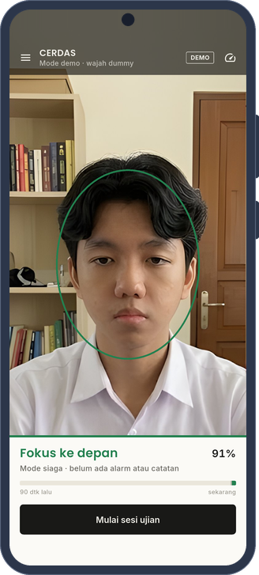 | 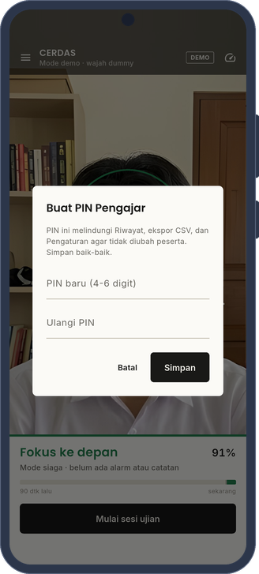 | 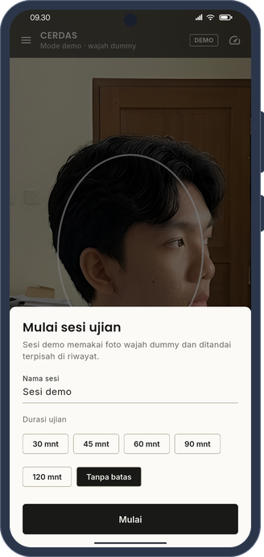 |  |
| Mode siaga | PIN pengajar | Mulai sesi | Peringatan menoleh |
|  | 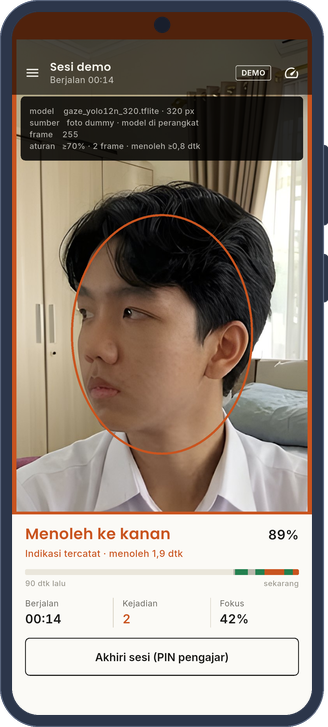 |  | 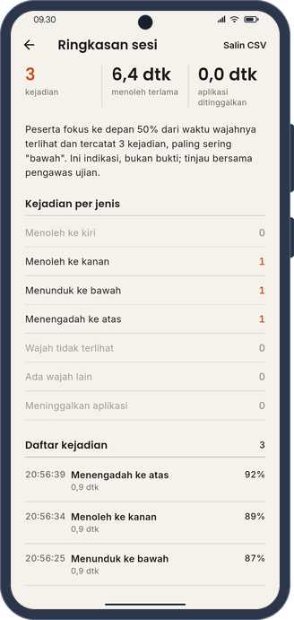 |
| Sesi berjalan | Info teknis | Ringkasan sesi | Kejadian sesi |
| 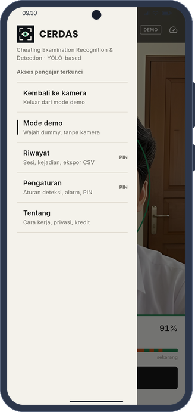 |  | 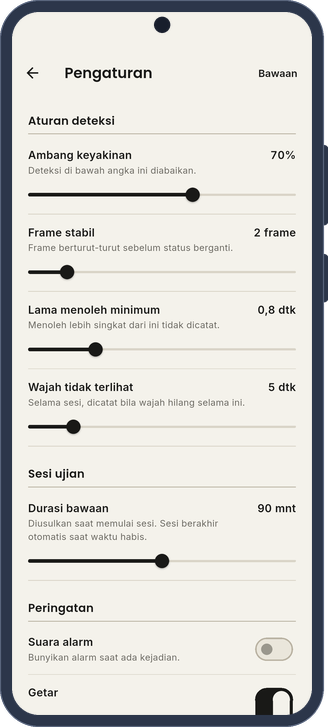 | 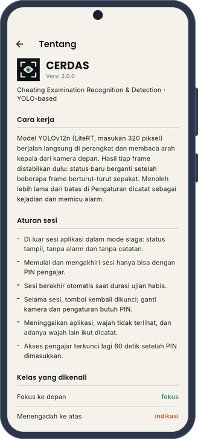 |
| Menu | Riwayat | Pengaturan | Tentang |

Bingkai ponsel digambar sendiri dengan skrip `phone_frame.py` dari repo [MEIRA](https://github.com/khaichi11/MEIRA)
(Apache-2.0), tanpa memakai templat perangkat dari pihak lain.

### Struktur proyek

```
lib/
  main.dart                     titik masuk, tema, dan layanan
  logic/proctor_engine.dart     stabilisasi, aturan menoleh, wajah hilang, dan durasi sesi
  models/                       arah pandang, kejadian, dan sesi ujian
  services/                     pengaturan, riwayat, sesi, alarm, mode demo, dan PIN pengajar
  screens/                      kamera, ringkasan sesi, riwayat, pengaturan, dan tentang
  widgets/                      oval wajah, garis waktu, panel status, tabel, dan menu
  theme/app_theme.dart          gaya lembar ujian (kertas, tinta, garis) dengan Poppins dan Inter
assets/                         model, suara alarm, foto demo, logo, dan huruf
tools/                          pembuat alarm, ikon, dan foto demo
Training_Yolo/                  notebook pelatihan dan model arsip
test/, integration_test/        uji unit, uji widget, dan pengambilan tangkapan layar
```

### Privasi dan etika

Gambar kamera tidak pernah disimpan maupun dikirim; aplikasi hanya menyimpan arah kepala, tingkat keyakinan, waktu,
dan durasi. Arah kepala merupakan **indikasi**, bukan bukti, sehingga hasilnya perlu ditinjau bersama pengawas ujian.
Peserta juga perlu diberi tahu bahwa ujian dipantau dengan kamera sebelum sesi dimulai.

### Lisensi dan kredit

- Kode aplikasi berlisensi **AGPL-3.0** ([LICENSE](LICENSE)) karena model dilatih dengan Ultralytics dan aplikasi
  memakai plugin `ultralytics_yolo`, yang keduanya berlisensi AGPL-3.0.
- Model YOLOv12n dilatih oleh Khairuramdhani dan Naufal Arya Pradipta.
- Foto wajah dummy menampilkan orang fiktif yang dibuat dengan AI (Google Gemini) oleh pemilik proyek, kemudian
  diperbesar dengan [Real-ESRGAN](https://github.com/xinntao/Real-ESRGAN) (BSD-3-Clause).
- Huruf Poppins dan Inter memakai SIL Open Font License 1.1; lisensinya tersedia di `assets/fonts/`.
- Logo dan ikon dibuat sendiri dengan [`tools/make_icon.py`](tools/make_icon.py).

---

## English

### About

CERDAS (Cheating Examination Recognition & Detection) monitors the examinee's head direction through the front
camera. A YOLOv12n model recognises five classes: `depan` for facing forward, and `atas`, `bawah`, `kiri`, and `kanan`
for looking up, down, left, and right. When a look-away lasts longer than the limit set by the teacher, the app sounds
an alarm, vibrates, and records the incident. All inference runs on the device without an internet connection.

The opening follows a proctoring camera theme. On a dark screen the greeting "Halo!" is typed letter by letter, then
four viewfinder corners move in from the screen edges and lock in the centre while a scan line sweeps down and turns
the screen light. Inside the viewfinder a face turns now and then: the corners are green when it faces forward and
orange when it looks away, just as the app detects. Tapping the left or right side of the screen makes the face turn
that way. The teacher PIN prompt now locks for a while after five wrong attempts, for longer each time, so the PIN
cannot be guessed one by one during an exam.

### Highlights

Detection runs in real time with LiteRT and uses the GPU when one is available. A face oval in the centre of the
screen guides the examinee's position, a 90-second timeline summarises recent behaviour, and a minimum look-away rule
ignores brief glances. Exam sessions are started by the teacher with a PIN and a planned duration, and they end
automatically when the time runs out.

The session rules prevent examinees from working around the monitoring. The Android back button is locked, leaving
the app and the appearance of a second face are recorded, switching cameras requires the PIN, and the teacher's access
expires sixty seconds after the PIN is entered. Outside a session the app stays in standby mode, where detection is
shown for positioning but no alarms or records are produced. A demo mode runs the real model on five dummy faces
without a camera, and the history lists every session and incident with CSV export.

### Performance

The model itself is light, with a 320-pixel input and about 9 ms per frame on a desktop CPU. The old version of the
app was slow because of its processing pipeline rather than the model. The plugin used to convert every frame to JPEG
and back; it has been upgraded to version 0.6.15, which passes RGBA frames directly to LiteRT 2.x. The whole screen
used to rebuild on every frame; detections now flow through `ProctorEngine` and `ValueNotifier`s, so the interface
updates only when the state changes. The camera is also paused while other screens are open. The actual frame rate
depends on the device and is capped by the camera, usually at 30 fps.

### Running

```bash
flutter pub get
flutter run
flutter test
flutter build apk --release --split-per-abi
```

The app currently supports Android only, with minSdk 24. Screenshots are generated with
`flutter drive --driver=test_driver/integration_test.dart --target=integration_test/screenshots_test.dart`, and the
phone frames in this README are drawn with the `phone_frame.py` script from the
[MEIRA](https://github.com/khaichi11/MEIRA) repository (Apache-2.0).

The demo GIF at the top is rendered on a laptop without an emulator: `test/demo_render_test.dart` draws every screen
and saves the frames, and `tool/render_gif.py` then places them in a phone frame with a status bar.

```bash
DEMO_FRAMES=build/frames flutter test test/demo_render_test.dart
python3 tool/render_gif.py build/frames docs/images/demo.gif
```

### Privacy

Camera frames are never stored or uploaded; only the head direction, confidence, time, and duration are kept. Head
direction is an indication rather than proof, so incidents should be reviewed together with the exam supervisor.

### License

The code is licensed under AGPL-3.0 because the model was trained with Ultralytics and the app uses the
`ultralytics_yolo` plugin, both of which are AGPL-3.0. The demo faces show fictional people generated with Google
Gemini and upscaled with Real-ESRGAN (BSD-3-Clause). Poppins and Inter are available under the SIL Open Font License
1.1.
